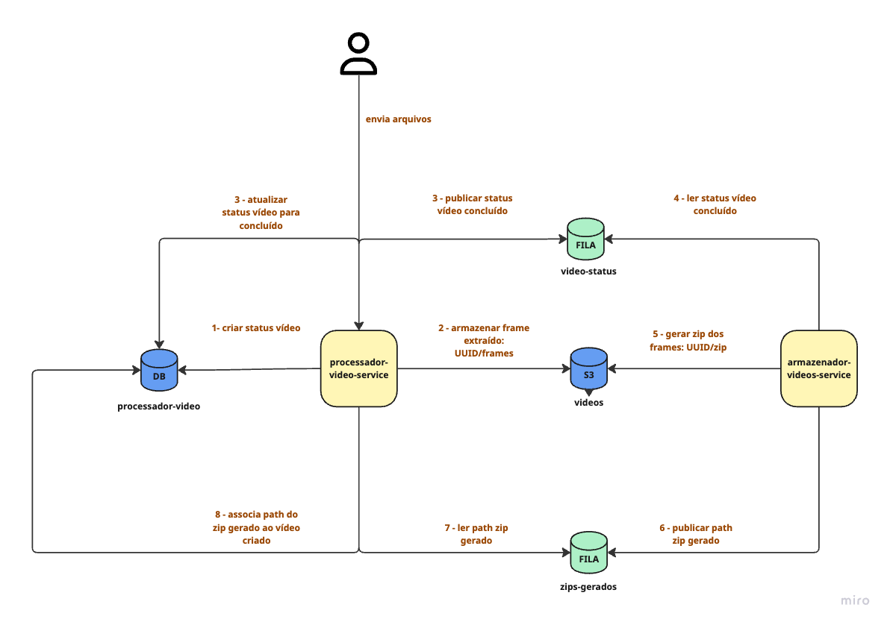
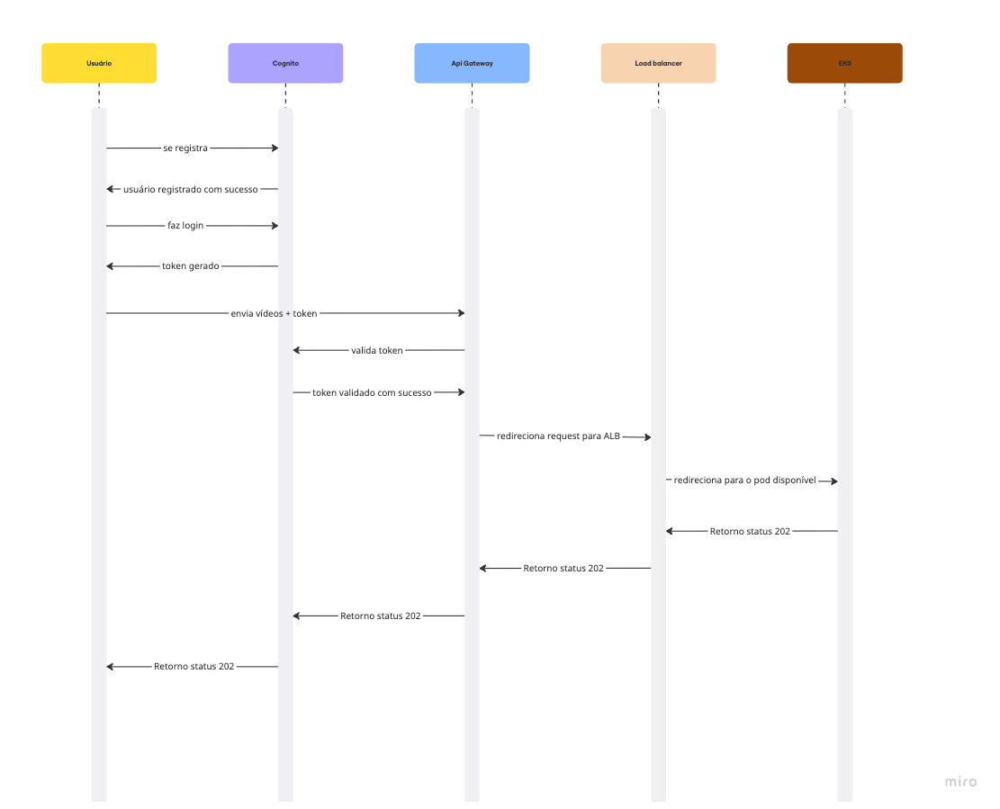

# Hackaton - Complemento

Este projeto fornece a infraestrutura e a documentação do projeto final do curso de Arquitetura de Software.

## Desafio

O projeto desenvolvido está sem nenhuma das boas práticas de arquitetura de software que nós
aprendemos no curso.
O seu desafio será desenvolver uma aplicação utilizando os conceitos apresentados no curso como:
desenho de arquitetura, desenvolvimento de microsservicos, Qualidade de Software, Mensageria …etc
E para ajudar o seu grupo nesta etapa de levantamento de requisitos, segue alguns dos pré
requisitos esperados para este projeto:

- A nova versão do sistema deve processar mais de um vídeo ao mesmo tempo;
- Em caso de picos o sistema não deve perder uma requisição;
- O Sistema deve ser protegido por usuário e senha;
- O fluxo deve ter uma listagem de status dos vídeos de um usuário;
- Em caso de erro um usuário pode ser notificado (email ou um outro meio de comunicação)

Requisitos técnicos:

- O sistema deve persistir os dados;
- O sistema deve estar em uma arquitetura que o permita ser escalado;
- O projeto deve ser versionado no Github;
- O projeto deve ter testes que garantam a sua qualidade;
- CI/CD da aplicacao

## Diagrama da Arquitetura



## Autenticação Cognito



## Conteúdo

- aws_app: Contém os recursos que serão utilizados dentro do eks 
- aws-core: Contém a infra core do projeto: criação de vcp, subnet, eks, node, gateway, cognito
- aws-rds: Contém a infra do banco de dados postgres
- documentacao: Contém a colletion e os fluxos do sistema
- teste-performance: Contém um teste de carga com k6

## Pré-requisitos

Certifique-se de que os seguintes itens estão configurados antes de executar o projeto:

1. **Terraform**: Instalado na sua máquina.
2. **AWS CLI**: Instalado e configurado.
3. **Credenciais da AWS**: Configuradas via variáveis de ambiente ou arquivo de credenciais.

### Configurando as credenciais da AWS

Você pode configurar suas credenciais usando o AWS CLI:
```bash
aws configure
```

Ou definindo diretamente as variáveis de ambiente:
```bash
export AWS_ACCESS_KEY_ID="sua-access-key-id"
export AWS_SECRET_ACCESS_KEY="sua-secret-access-key"
export AWS_DEFAULT_REGION="us-east-1"
```

## Comandos do Terraform

### **1. terraform init**
Inicializa o ambiente Terraform no diretório do projeto. Este comando:
- Baixa os provedores necessários, como o AWS Provider.
- Prepara o diretório `.terraform` para gerenciar o estado e plugins.

```bash
terraform init
```

---

### **2. terraform validate**
Valida a sintaxe e a configuração do Terraform. Este comando garante que não há erros no código antes de criar os recursos.

```bash
terraform validate
```

Se tudo estiver correto, a saída será:
```plaintext
Success! The configuration is valid.
```

---

### **3. terraform plan**
Gera um plano de execução, mostrando quais recursos serão criados, alterados ou destruídos. Este comando **não aplica as mudanças**, apenas mostra o que será feito.

```bash
terraform plan
```

Exemplo de saída:
```plaintext
Plan: 5 to add, 0 to change, 0 to destroy.
```

---

### **4. terraform apply**
Aplica o plano de execução e cria ou atualiza os recursos na AWS. O Terraform solicitará confirmação antes de executar.

```bash
terraform apply
```

Quando solicitado, digite `yes` para confirmar a aplicação.

Exemplo de saída ao final:
```plaintext
Apply complete! Resources: 5 added, 0 changed, 0 destroyed.
```

---

### **6. terraform destroy**
Remove todos os recursos criados pelo Terraform. O comando solicitará confirmação antes de destruir os recursos.

```bash
terraform destroy
```

Quando solicitado, digite `yes` para confirmar a destruição.

Exemplo de saída ao final:
```plaintext
Destroy complete! Resources: 5 destroyed.
```

---

## Fluxo Completo de Execução

Siga as etapas abaixo para configurar e executar o projeto:

1. **Inicializar o Terraform**
   ```bash
   terraform init
   ```

2. **Validar a configuração**
   ```bash
   terraform validate
   ```

3. **Gerar o plano**
   ```bash
   terraform plan
   ```

4. **Aplicar o plano**
   ```bash
   terraform apply
   ```

5. **Visualizar os Outputs**
   ```bash
   terraform output
   ```

6. **Destruir os recursos (opcional)**
   ```bash
   terraform destroy
   ```

# Subindo recursos do EKS

## Criar PVC

```bash
eksctl utils associate-iam-oidc-provider \
  --region=<REGION> \
  --cluster=<CLUSTER_NAME> \
  --approve
```

```bash
eksctl create iamserviceaccount \
  --name ebs-csi-controller-sa \
  --namespace kube-system \
  --cluster <CLUSTER_NAME> \
  --attach-policy-arn arn:aws:iam::aws:policy/service-role/AmazonEBSCSIDriverPolicy \
  --approve \
  --role-name AmazonEKS_EBS_CSI_DriverRole
```

```bash
eksctl create addon \
  --name aws-ebs-csi-driver \
  --cluster <CLUSTER_NAME> \
  --region <REGION> \
  --service-account-role-arn arn:aws:iam::<AWS_ID>:role/AmazonEKS_EBS_CSI_DriverRole
```

## Sistema de Arquivos EFS

### Criar Role EKS_EFS_CSI_DriverRole
```bash
aws iam create-role \
  --role-name AmazonEKS_EFS_CSI_DriverRole \
  --assume-role-policy-document file://aws_app/trust-policy.json
```

### Anexar política necessária à role
```bash
aws iam attach-role-policy \
  --role-name AmazonEKS_EFS_CSI_DriverRole \
  --policy-arn arn:aws:iam::aws:policy/service-role/AmazonEFSCSIDriverPolicy
```

### Criar EFS
```bash
aws efs create-file-system \
  --region <REGION> \
  --tags Key=Name,Value=efs-processador-video \
  --performance-mode generalPurpose
```

### Instalar o EFS CSI DIVER
```bash
eksctl create addon \
  --name aws-efs-csi-driver \
  --cluster <CLUSTER_NAME> \
  --region <REGION> \
  --service-account-role-arn arn:aws:iam::<AWS_ID>:role/AmazonEKS_EFS_CSI_DriverRole \
  --force
```

# Comandos para rodar os recursos do EKS

## onfig inicial
```bash
kubectl apply -f metrics.yaml
kubectl apply -f secrets.yaml
kubectl apply -f storage-class.yaml
kubectl apply -f storage-class-efs.yaml
```

## rabbitmq
```bash
kubectl apply -f rabbitmq/rabbitmq-pvc.yaml
kubectl apply -f rabbitmq/rabbitmq-srv.yaml
kubectl apply -f rabbitmq/rabbitmq-deployment.yaml 
```

## processador-video
```bash
kubectl apply -f processador-video/processador-video-pvc.yaml
kubectl apply -f processador-video/processador-video-configmap.yaml
kubectl apply -f processador-video/processador-video-srv.yaml
kubectl apply -f processador-video/processador-video-deployment.yaml
kubectl apply -f processador-video/processador-video-deployment-hpa.yaml
```

## armazenamento-video
```bash
kubectl apply -f armazenamento-video/armazenamento-video-configmap.yaml
kubectl apply -f armazenamento-video/armazenamento-video-srv.yaml
kubectl apply -f armazenamento-video/armazenamento-video-deployment.yaml 
```

# Executando teste de carga

```bash
k6 run --env TOKEN=<SEU_TOKEN> /teste_performance/upload_test_k6.js
```


